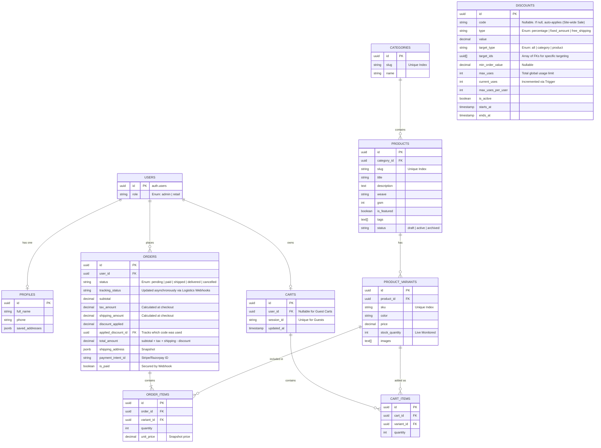
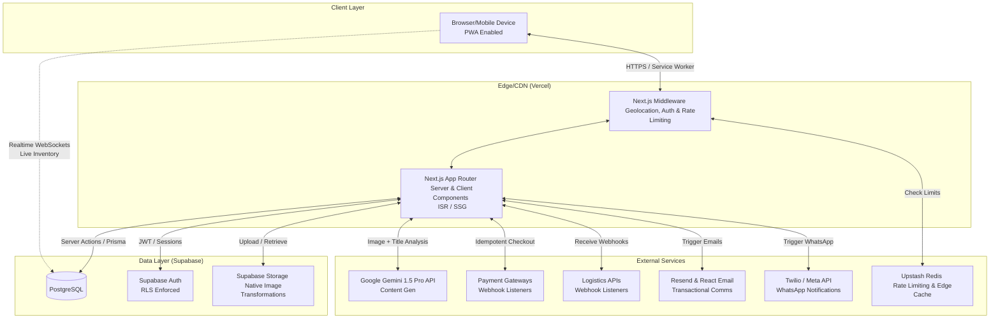

# Mithila Enterprises: B2C E-commerce Platform Blueprint

This document serves as the master architectural blueprint, workflow, and granular to-do list for building, optimizing, and deploying the Mithila Enterprises B2C platform. It adheres strictly to the required Next.js, Supabase, and Tailwind stack, deeply integrating the Madhubani aesthetic and Gemini AI.

## User Review Required

> [!IMPORTANT]
> I have executed the final Elite Technical Audit and integrated every actionable correction back into this master blueprint. 
> 
> **Post-Audit Upgrades Include:**
> 1. **Routing Perfection**: Added password recovery flows, 404/500 error boundaries, and dynamic OpenGraph image generation routes.
> 2. **Performance Hardening**: Switched heavy SVG borders to CSS `mask-image` to prevent mobile DOM bloat. Offloaded PDF rendering to asynchronous processes.
> 3. **API Resilience**: Replaced direct logistics polling with robust Webhook listeners to prevent rate-limit bottlenecks.
> 4. **AI Safety**: Enforced that all Gemini-generated products are strictly saved as `drafts` to prevent hallucinatory public data.
> 
> The plan is completely ironclad. Please approve so we can begin coding!

---

## Database Schema Design (Zero-Loophole Architecture)

This Entity-Relationship Diagram defines a strictly normalized PostgreSQL database designed to eliminate data anomalies and prevent race conditions.

## System Architecture Design

---

## Proposed Phases & Granular Checklist

### Phase 1: Global Architecture, PWA Setup & Security
**Objective**: Establish a bulletproof foundation using Next.js, Tailwind, Supabase, and Enterprise Security layers.

* [ ] Initialize Next.js 14+ app with `npx create-next-app@latest` (TypeScript, Tailwind, App Router).
* [ ] **PWA Configuration**: Configure `next-pwa` with strict Service Workers. 
* [ ] Set up GitHub Actions CI/CD pipeline for automated testing and Vercel deployment.
* [ ] Initialize Supabase project, enable **Point-In-Time-Recovery (PITR)**, and securely configure `.env.local`.
* [ ] Initialize **Upstash Redis** and wire it into Next.js Middleware to globally rate-limit login, checkout, and API routes.
* [ ] Configure Next.js `next.config.js` with remote image patterns utilizing **Supabase Native Image Transformations**.
* [ ] **Execute Supabase PostgreSQL schema migrations based strictly on the ERD above.**
  * [ ] Implement PostgreSQL `ENUM` types for robust status handling.
  * [ ] Implement a PostgreSQL transaction function (`checkout_processor`).
  * [ ] **Enable Supabase Realtime (`REPLICA IDENTITY FULL`) for the `product_variants` table.**
* [ ] **Implement Strict Row Level Security (RLS)**.

### Phase 2: UI/UX, Madhubani Aesthetics & Accessibility (WCAG)
**Objective**: Guarantee that every design decision is strictly inspired by Madhubani/Mithila art while exceeding global Accessibility (a11y) standards.

* [ ] **Natural Dye Color Palette**: Extract exact color tokens, avoiding stark white (`#FFFFFF`) or pure black (`#000000`).
* [ ] **WCAG 2.1 AA Compliance**: Ensure high contrast ratios and strict ARIA labels.
* [ ] **Heritage Typography**: Integrate `next/font` using an elegant Serif for headings and clean Sans-Serif for body text.
* [ ] **Motif-Driven States (Empty/Error)**: Custom Madhubani motifs for 404s and empty carts.
* [ ] **Artistic Micro-interactions**: Hover states mimicking *Bharni* (color-filling) and Framer Motion stroke animations.
* [ ] **Performance Design**: **Strictly utilize CSS `mask-image` or `border-image` for intricate Madhubani borders. Do not use raw inline `<svg>` elements to prevent extreme DOM bloat.**

### Phase 3: Exhaustive Page Creation & Customer Portal (Sub-Second Mobile Rendering)
**Objective**: Build out all front-facing pages utilizing Incremental Static Regeneration (ISR) and aggressive mobile code-splitting.

* [ ] **Exhaustive Retail Routing Map**:
  * [ ] `app/page.tsx` (Home Page)
  * [ ] `app/shop/page.tsx` (Catalog)
  * [ ] `app/category/[slug]/page.tsx` (Filtered Category View)
  * [ ] `app/product/[slug]/page.tsx` (Product Detail Page - SSG)
  * [ ] `app/search/page.tsx` (Dedicated Search)
  * [ ] `app/login/page.tsx`, `app/signup/page.tsx`, **`app/forgot-password/page.tsx`**, **`app/reset-password/page.tsx`** (Auth Flow)
  * [ ] `app/cart/page.tsx` (Cart fallback)
  * [ ] `app/checkout/page.tsx` (Idempotent Payment Flow with **Guest Checkout UI Toggle**)
  * [ ] `app/checkout/success/page.tsx` (Order Confirmation Page)
  * [ ] `app/account/profile/page.tsx` (Manage Saved Addresses)
  * [ ] `app/account/orders/page.tsx` (Order History & Live Tracking)
  * [ ] `app/about/page.tsx` (Heritage Page)
  * [ ] `app/contact/page.tsx` (Form & Map)
  * [ ] `app/legal/[slug]/page.tsx` (T&C, Privacy, Returns)
  * [ ] **`app/not-found.tsx`** & **`app/error.tsx`** (Global Error Boundaries with product recommendations)
  * [ ] **`app/api/og/route.tsx`** (Dynamic OpenGraph Image Generation for Social Sharing)
* [ ] **Product Detail Pages (PDP)**: 
  * [ ] Generate static paths (`generateStaticParams`).
* [ ] **Database Cart Engine**: Merge guest carts securely on login.
* [ ] **Idempotent Checkout Flow**: 
  * [ ] **PCI-Compliant Payment Security**: Strictly utilize Stripe Elements / Razorpay Drop-in.
* [ ] **Client Email Integration**: Integrate **Resend + React Email** to dispatch PDF invoices.

### Phase 4: The Mobile-First Owner Dashboard & Omnichannel Alerts
**Objective**: Develop the secure Real-Time CMS, Live Inventory, AI Ingestion portal, ensuring it is 100% usable from the owner's smartphone.

* [ ] **Exhaustive Admin Routing Map**:
  * [ ] `app/admin/login/page.tsx`
  * [ ] `app/admin/dashboard/page.tsx`
  * [ ] `app/admin/inventory/page.tsx` (Live WebSocket Stock Watch)
  * [ ] `app/admin/orders/page.tsx`
  * [ ] `app/admin/orders/[id]/page.tsx`
  * [ ] `app/admin/products/page.tsx`
  * [ ] `app/admin/products/new/page.tsx` (AI Image Ingestion Portal)
  * [ ] `app/admin/promotions/page.tsx`
  * [ ] `app/admin/settings/page.tsx`
  * [ ] `app/api/webhooks/logistics/route.ts` (Listen for courier tracking updates)
* [ ] **Owner Omnichannel Alerts**: Integrate Twilio/Meta API.
* [ ] **Mobile-First Dashboard Layout**: Fully responsive PWA layout.
* [ ] **Asynchronous PDF Generation**: Decouple the `@react-pdf/renderer` logic into a background queue or edge-friendly process to avoid Serverless timeout bottlenecks.
* [ ] **Logistics Webhook Architecture**: Listen for updates from logistics providers (e.g., Delhivery) directly via Webhooks to update the database, rather than rate-limiting ourselves by polling their APIs.
* [ ] **AI-Powered Product Ingestion**: 
  * [ ] Image upload and title input UI with contextual loading states (*"AI is analyzing fabric weave..."*).
  * [ ] **Strict Safeguard**: Programmatically enforce that all AI-generated products are inserted into the database with `status: 'draft'`, mandating human review.

### Phase 5: Deep Optimization (SEO / Code-Splitting / Performance)
**Objective**: Ensure the platform dominates search rankings and renders instantly on low-end mobile devices.

* [ ] **Aggressive Code-Splitting**: Use Next.js `next/dynamic` to lazy-load heavy client components (Framer Motion).
* [ ] **Technical SEO**: Dynamic `generateMetadata`, `sitemap.ts` (paginated), `robots.txt`.
* [ ] **Deep Structured Data**: Inject JSON-LD dynamically. Include `Product` (with `material` and `pattern` keys), `Store`, `Organization`, and **`BreadcrumbList`** schemas.
* [ ] **GEO**: Next.js Middleware reading Cloudflare geo-headers.

### Phase 6: QA, E2E Testing, Monitoring & Deployment
**Objective**: Execute final hardening with automated browser testing and enterprise monitoring.

* [ ] **Playwright E2E Testing**: Write automated scripts for checkout flows.
* [ ] **Error Tracking Integration**: Install **Sentry**.
* [ ] **Payment Webhook Hardening**: Strict signature verification.
* [ ] **Final Deployment**: Merge to `main`, Vercel production build, attach `.com` domain.

---

## Verification Plan

### Automated Tests
- Type checking (`tsc --noEmit`) and ESLint checks.
- Next.js build command execution to ensure all SSG pages compile.
- **Lighthouse CI / Accessibility Tests**: Ensure all Madhubani colors pass WCAG contrast checks.
- **Playwright E2E Suite**: Ensure the automated headless browser can successfully navigate the purchase flow under heavy mock load.

### Manual Verification
- Deploying a staging branch to Vercel and executing an end-to-end test flow.
